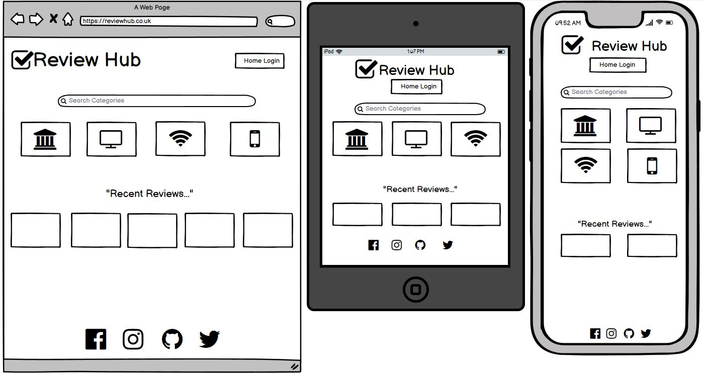

1. Purpose of the project
2. user stories
3. Features
4. future features
5. Typography and color scheme
6. wireframes
7. Technology
8. testing
   8.1 code validation
   8.2 test cases (user story based with screenshots)
   8.3 fixed bugs
   8.4 supported screens and browsers
9. Deployment
   9.1 via gitpod
   9.2 via github pages
10. credits

<h1 align="center">Review Hub</h1>

[View the live project here]

![Image of the website on desktop, laptop, tablet and mobile]

### This project is a fictational reviews website to enable users to create, read, update and delete their reviews on one platform.

## User Experience (UX)
***
- ### User stories
    - #### Visitor goals:
        1. I want to create my own reviews on the website.
        2. I want to be able to log in and delete any of my reviews.
        3. I want to be able to receive feedback on my progress when creating or deleting content.

- ### Design
    * #### Color Scheme
        -  
    * #### Typography
        - 
    * #### Imagery
        1. 
        2. 
        3. 

- ### Wireframes
    

Main Page Wireframe:

    
    

    

My Account Wireframe:

    

    

## Features
***
* ### Current Features
    1. 
    2. 
    3. 
    
* ### Future Features
    1. 
    2. 
    3. 
    
        
## Technologies Used
***
### Languages Used
* 
* 

### Frameworks, Libraries & Programs Used
* 

## Testing
***
* ### Testing user stories from user experience (UX).
    * #### Aim 1

    * #### Aim 2
    
    * #### Aim 3
        
* ### Code validation.
    * 
    * 
    * 

* ### Supported screens and browsers.
    * 
    * 
    * 
    

* ### Fixed bugs.
    * 
    * 
    * 
    

## Deployment
***
* ###
* ###
* ###

## Credits
***
* ### Code

* ### Content

* ### Media

* ### Acknowledgements
