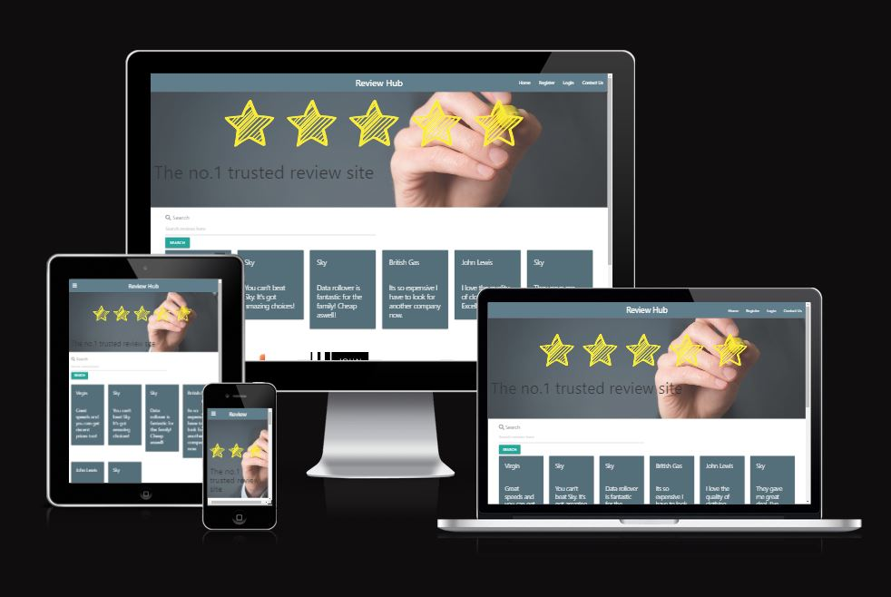
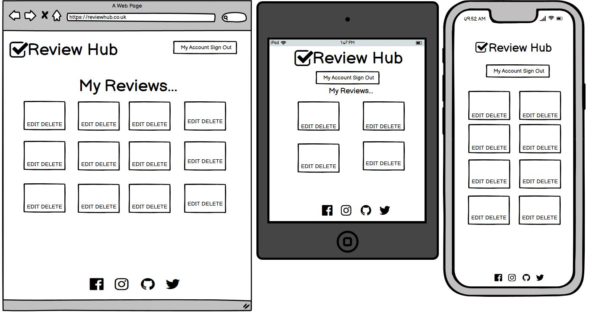
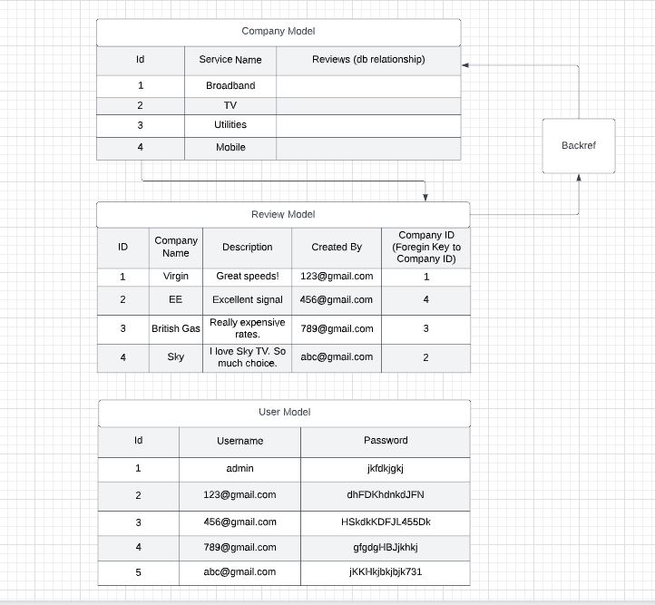
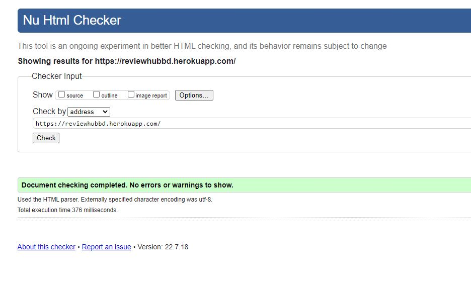
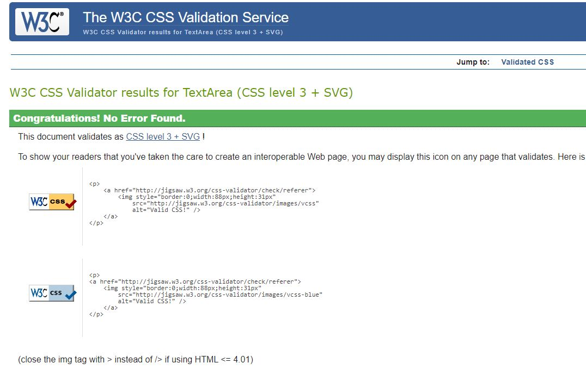
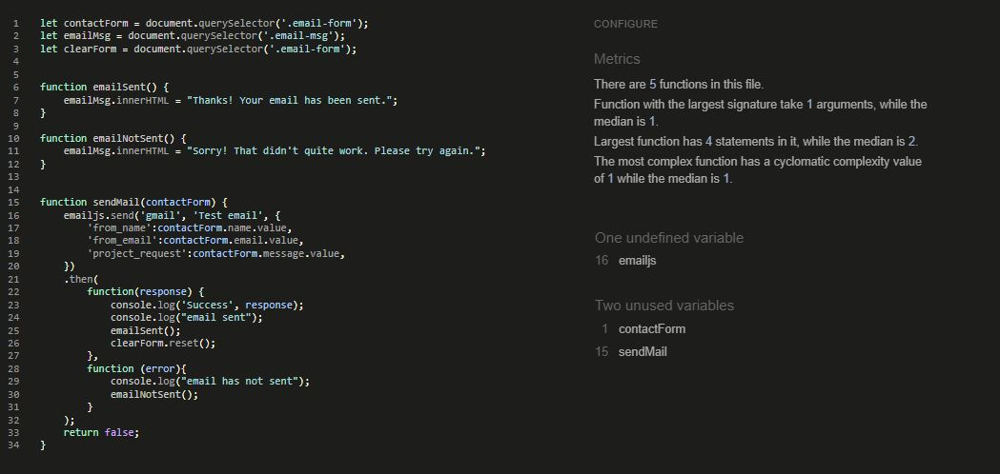
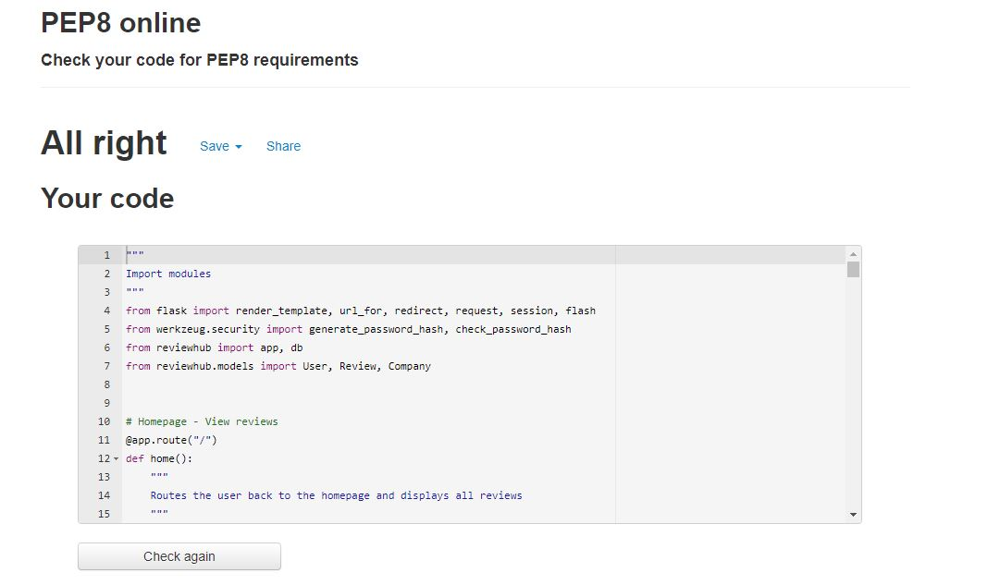
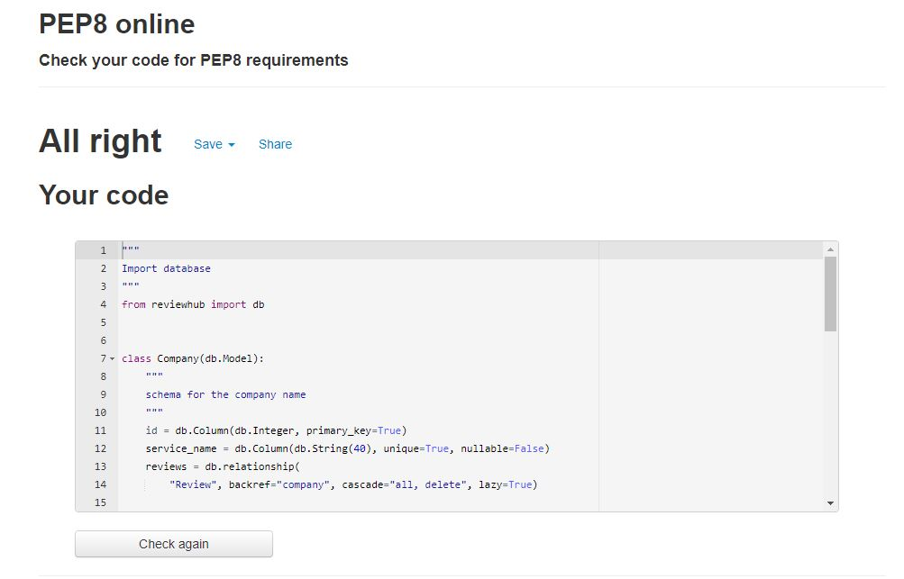
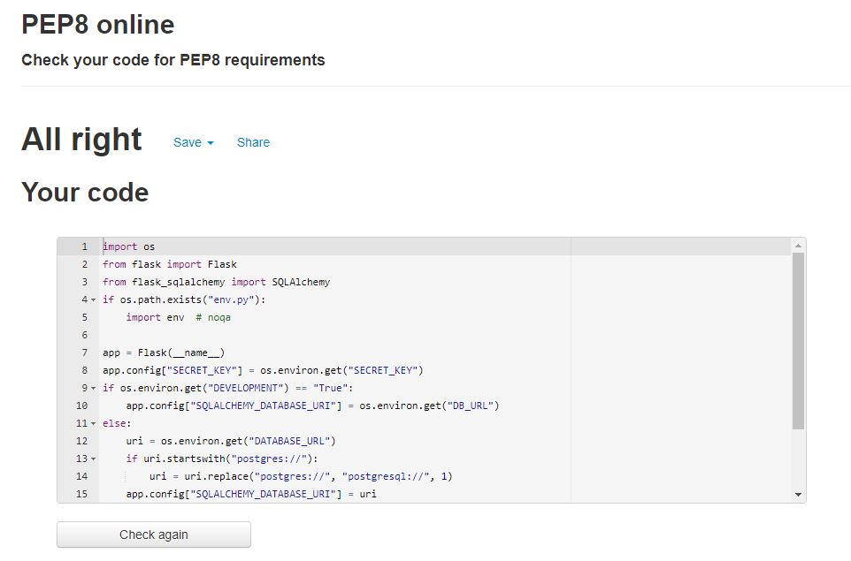
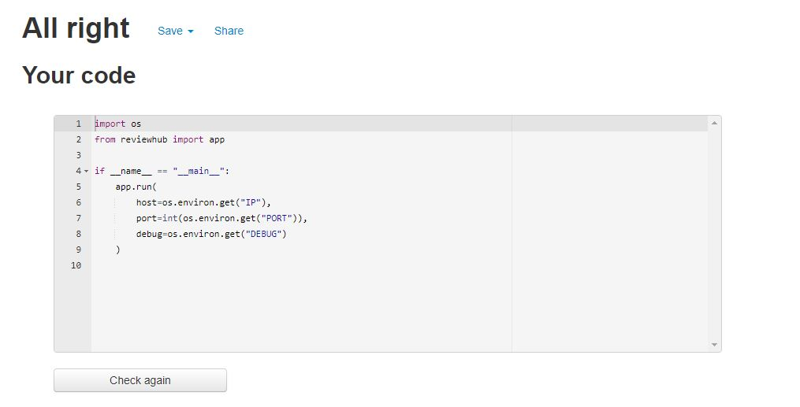

<h1 align="center">Review Hub</h1>

[View the live project here](https://reviewhubbd.herokuapp.com/)

### This project is a fictational reviews website to enable users to create, read, update and delete their reviews on one platform.

## User Experience (UX)
***
- ### User stories
    - #### Registered User goals:
        1. I want to be able to log in and delete any of my reviews.
        2. I want to create my own reviews on the website.
        3. I want to be able to receive feedback on my progress when creating or deleting content.
    - #### Unregistered User goals
        1. I want to be able to contact the organisation.
        2. I want to search general reviews without having to log in.
    - #### Admin Goals
        1. I want to be able to create, read, update and delete company categories.
        2. I want to be able to delete any reviews.
- ### Design
    * #### Color Scheme
        -  Grey and white.

    * #### Imagery
        - The hero image on the main page is designed to draw attention using review stars to make it obvious what the site is about.

- ### Wireframes
    

Main Page Wireframe:

    
    

    

My Account Wireframe:

    

    

## Features
***
* ### Current Features
    * Main Page:
        1. View all reviews created by all users.
        2. Register a new account.
        3. Login ability for each users account.
        4. Contact the organisation via an email form.
        5. Footer - clickable external links to social media pages.
    * Register Page:
        1. Submit personal information and it will be stored on a database.
        2. Once details are logged it will route you to your own account page.
    * My Account Page:
        1. Add a review and once added - will display on the main page and in your own account.
        2. Each review allows you to edit the review with preset values to show the user what they previosuly input.
        3. Each review allows you to delete the review but triggers a defensive modal first to ensure the user is happy to delete it. If clicked yes, it will delete the review and route them back to their account. If no is clicked, it will cancel the delete and route back to their account.
        4. Logout;
            - Users once finished can log out successfully and they willbe routed back to the login page with a flash message confirming the log out.
    *   Contact us page;
        1. Users are able to click on the contact page throughout so they can send an email and get in touch. This feature is on all pages for ease of access.
        2. Each input field has direction so the user can type the right details with all fields being madatory.
        3. If emails have successfully sent, a message will pop confirming this. If unsuccessful the message will ask them to try again.
    * Admin Access;
        1. A designated account has been reserved for admin. The admin can log in.Once they do, they will be routed to a dashboard where they can;
            * create company categories
            * edit company category names
            * delete company categories and its associated reviews.
            * delete any review (incase of any malicious revies.) again; with a defensive modal.
    
* ### Future Features
    * Due to time constraints, the following features could not be added but will be enabled in the future;
        1. Edit own details and delete own account.
        2. Filter options within the search functionality.
        3. Image incorporation for each review.
        
        
## Technologies Used
***
* ### Languages Used
    * Frontend;
        - HTML, CSS, jQuery.
    * Backend;
        - Python
* ### Development Tools.
    * Github.
        - Used to store the projects after being pushed using Git.
    * Gitpod.
        - Hosts the coding workspace.
    * Heroku.
        - Cloud platform for deploying the app.

* ### Frameworks, Libraries & Programs Used
    * MaterialzeCSS.
        - Used for responsiveness.
    * Flask.
        - A web-framework app responsible to render templates.
    * Balsamiq
        - Used to create wireframes of the website.
    * Jinja.
        - Template language for python for easy creation of backend code through to the frintend.
    * Werkzeug Security.
        - Used for password hashing and password authorisation.

* ### Database structure.
    * PostgreSQL.
        - Stores relational data to implement CRUD functionality.
            

View database schema here:

            
            

        - The database is structured into 3 models;
            1. Company model - contains the company category types.
                - How is it utilised?
                    - Admin is the only one who can create a company category.
                    - Each cateogry has a unique ID once created.
                    - The company category is linked to the reviews. On deletion of a category - any reviews connected as a sub-cateogry will also be deleted.
            2. Review model - users create reviews under the category contained in the Company model above.
                - How is it utilised?
                    - Any registered user can create a review.
                    - Each review is put into a company category available as a drop down option. This is also the case for editing a review.
                    - On deletion of a review, this will not affect the company category.
            3. User model - registration details are stored here.
                - How is it utilised?
                    - Anyone can create an account using a username and a password.
                    - Usernames are set to unique.
                    - This username is linked to reviews through code in the routes file and adding reviews html files.
                        1. The username is set to session user.
                        2. The session user is fixed in the created_by field of the add_review.html form.
                        3. This sends the session user as being the created_by value from the form and in the 'add_review' in the routes file.
                        4. It now becomes the value in the 'created_by' column of the Review model.
                        5. On editing and deleting reviews, this will not impact the company category.
    * Issues faced
        - I initially used MongoDB to store tasks and PostgreSQl to store user details to illustrate combined usage given that MongoDB can store more data that doesnt need to be linked. This proved more complicated than necessary as it was producing several bugs which I then decided with time constraints to redo the project with just PostgreSQL with all CRUD funtionality and user authentication still achievable.

## Testing
***
* ### Testing user stories from user experience (UX).
    - Registered Users;
        * #### Aim 1 - I want to be able to log in and delete any of my reviews.
            - Result - Once a logged in, a user can;
                1. Click on my account.
                2. All their own reviews are visible on their account page.
                3. Buttons are accessible to delete straight from the same page.
                4. Once clicked a modal will pop up.
                5. Clicking yes will confirm deletion and clicking no will cancel the deletion and route back to their account.

        * #### Aim 2 -I want to create my own reviews on the website.
            - Once a logged in, a user can;
                1. Click on 'add a review' in their menu tab.
                2. Users will be guided to a form to add a review.
                3. Once filled out and submitted; the users review will pop up on the main website page aswell as their own.
        
        * #### Aim 3 - I want to be able to receive feedback on my progress when creating or deleting content.
            - Logging out;
                1. When the user logs out, a flash message will appear at the top of the page confirming they are logged out.
    - Unregistered User goals
        - #### Aim 1 - I want to be able to contact the organisation.
            - Send an email;
                1. Click on the 'contact us' page (accessible even whilst logged out).
                2. Enter name in the name field.
                3. Enter email address in the email field.
                4. Type a message in the message field.
                5. Click send.
                6. If email is successfully sent, a message will populate at the top confirming this.
                7. If the email doesn't send,  the flash message will notify them to try again.
        - #### Aim 2 - I want to search general reviews without having to log in.
            - Search reviews on the main page;
                1. A search box appears on the main page without having to log in.
                2. Type any descriptive keyword and the user will be guided to a results page displaying reviews that contain that keyword (using exact match).
                3. Type any company name and the user will be guided to a results page displaying reviews that contain that company name (using exact match). 
    - Admin Goals
        - #### Aim 1 - I want to be able to create company categories.
            - Add company category after logging in.
                1. Admin needs to log in using the designated admin email.
                2. They will be directed to the dashboard.
                3. Click on 'add company.'
                4. A form will populate and enter the name of the company category.
                5. Click submit and the new data will appear on the dashbaord and available as a dropdown option when registered users add a review.

        - #### Aim 1 - I want to be able to delete any reviews.
            - Delete reviews;
                1. Go to the admin dashboard and click on 'see reviews.'
                2. All reviews will show and a delete button will appear per review.
                3. Click delete and a modal will pop up to confirm the deletion.
                4. Click yes to delete and it will delete and route you back to the dashboard.
                5. Click no and it will ignore the deletion and route you back the dashboard.
        
* ### Code validation.
    

HTML Validation result:

    
    

    

CSS Validation:

    
    

    

JSHint Validation:

    
    

    
    

PEP 8 Results:

    
    
    
    
    

* ### Supported screens and browsers.
    * Mobiles
        - Iphone 12 Pro, Iphone X, Iphone SE, Iphone XR , Samsung Galaxy S20 Ultra, Samsung Galaxy S20 Plus, Samsung Galaxy Note 9, Samsung SA51/71, Samsung Galaxy s9.
    * Tablets
        - iPad Mini, iPad Air, iPad, iPad Pro, Samsung Tab S6
    * Laptops
        - 15" - 17" screens
    

* ### Fixed bugs.
    1. Admin unable to delete reviews.
        - Fix: input a line of code in 'delete review' view such that those who created the review aswell as admin (admin email) cant delete the reviews.
    2. The company category would populate when a user wants to edit a review.
        - Fix: added an if/else statement to the edit_review form to check if the company is the same as the review company and if so; then to pre-populate it, else leave it with a choice.
    3. The code broke when admin tried to delete a review from the main page.;
        - Fix: centralise the management of reviews by taking the code form the reviews page and put into the admin dashboard page.
* ### Known errors.
    1. PEP8 error popped up with lines being too long. Once made short they would generate white space errors, once that was fixed, indentation errors popped up. With the consultation of tutor support we agreed a # noqa with the error codes ha dto be placed.
    2. The admin - has a redunandant 'my account' page which I could have just added some logic either in the routes files or the html such that if it is the admin user, the my account page would be away from view.
    3. Footer is not sticky.
    4. Review Model does not return all values in the statement.

## Deployment
***
* Create a Heroku app.
    1. Create an account and log in to Heroku.
    2. Click on 'new' then 'create app' from the drop down.
    3. Create a unique app name and choose a region closest to you.
    4. Click 'create.'
* Push the local copy of the repo to Github
    1. Create a 'requirement.txt' file;
        * In the command line; type "pip3 freeze --local > requirements.txt". This will create a file with all the required installations needed.
    2. Create a Procfile;
        * Enter "echo web: python app.py > Procfile" which will create a file that Heroku needs. Remove any blank lines from this file as this can cause disruptions later.
    3. Ensure both files are at the root level.
* Add Heroku Config Vars;
    1. Click on settings from the Heroku main page.
    2. Click 'reveal config vars.'
    3. enter the following into each input field;
        * IP (0.0.0.0)
        * PORT (5000)
        * SECRET_KEY (YOUR_OWN_SECRET_KEY)
        * DATABASE_URL (Your own database URL)
        * DEBUG (True)
* Connect PostgreSQL in resources and db.create_all()
    1. Go to Heroku and click on 'resources.
    2. Type 'PostgreSQL' and click on 'Heroku POstgres.'
    3. Click on 'Hobby Dev - Free.'
    4. At the top right-hand corner, click on 'more' and from the drop down - click 'run console.'
    5. Once the command line loads, enter the following to load all the tables from the model.py file;
        * 'python3'
        * 'from reviewhub import db'
        * db.create_all()
        * click 'ctrl + c' to close the command line.
* Connect to Github;
    1. Click on 'deploy.'
    2. Click on 'Github'as a deployment method.
    3. Type in your repo name and click search.
    4. Once it finds it - click connect.
* Deploy;
    1. Ensure automatic deploys is checked, else click 'manual deploy' (to main branch.)

## Credits
***
* ### Code
    - Overall fundamental CRUD knowledge
        - The fundamental knowledge behind all CRUD functionality is inspired by Code Institutes Task Manager tutorial.

* ### Media
    - Image links are within the HTML as taken from Google sources. None of the images are attributed as mine.

* ### Acknowledgements
    - Mentor - Rohit Sharma has been brilliant is advising of cleaner code (althoughI couldn't implement all his advice due to time constraints).
    - Tutor Support - has been really helpful in guiding through any lack of understand in error or code logic.
